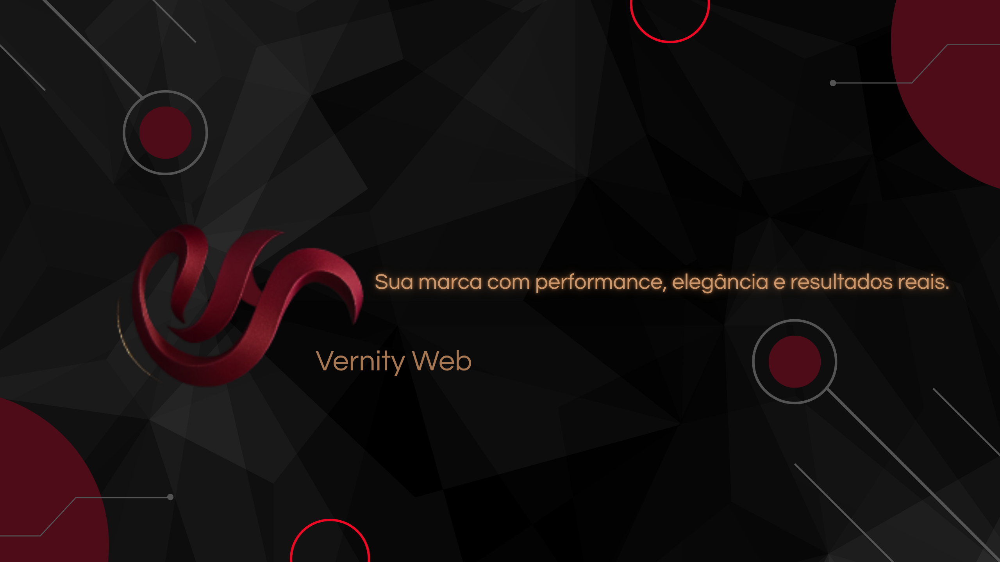

  

&nbsp;&nbsp;&nbsp;

Experiencing technology daily, I have been developing my skills in React and Node.js, as well as deepening my knowledge in SQL databases and notions in NoSQL. Always seeking to keep myself updated, I am currently specializing in Artificial Intelligence, Prompt Engineering, and LLMs, along with accessibility. I have completed a postgraduate degree in Industrial Automation and Robotics, which provided me with significant growth in programming logic, problem-solving, and the ability to apply reasoning in projects, from the overall view to specific tasks.
&nbsp;

I believe that the success of a software project is related to understanding client needs, business rules, and the application of best software architecture practices. With experience working in cross-functional teams, I am able to deliver quality solutions, taking into account resources, processes, performance, and especially the accessibility of applications and the integration of artificial intelligence.
&nbsp;

My current focus is on prompt engineering, artificial intelligence, and accessibility, following international guidelines in these areas that fascinate and motivate me to deepen my knowledge. I believe that technology should be inclusive, and I am committed to implementing practices that make applications accessible and responsive to all users.
&nbsp;

I consider myself a dedicated developer committed to results. I am seeking new challenges and opportunities to apply my knowledge and skills in pursuit of professional improvement and growth.
&nbsp;

Currently, I study English daily in continuous immersion, as I am focused on international career growth and, since it is a long journey, I know that preparation and consistency in language learning are necessary, just like in programming.
&nbsp;

 &nbsp;
 &nbsp;

## Minhas Skills

#### Principais Stack:

&nbsp;
&nbsp;
&nbsp;
&nbsp;
&nbsp;

#### Databases:

&nbsp;
&nbsp;

#### Workstation Tools:

&nbsp;
&nbsp;
&nbsp;

&nbsp;

&nbsp;

&nbsp;
&nbsp;

## Contacts:

 
 

&nbsp;&nbsp;
 
## idiomas:

 
### Idiomas

 Técnico Intermediario 

 

&nbsp;&nbsp;

  

