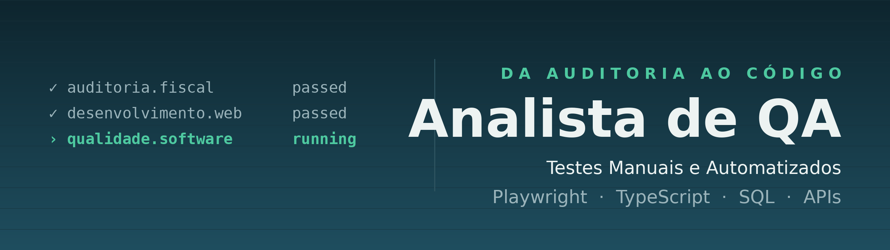

  

<h1 align="center">Vanessa Cardoso · Analista de QA</h1>

  <strong>Testes Manuais e Automatizados · Playwright · TypeScript · Testes de API · SQL</strong>

Analista de QA com base de desenvolvimento full-stack (React, TypeScript, Node.js, PostgreSQL) e mais de 20 anos de carreira voltada a <strong>auditoria, conformidade e clientes</strong> — do controller ao suporte de SaaS. Migrei para a Qualidade de Software pelo caminho natural do meu perfil: <strong>senso crítico</strong>. Questionar requisitos, antecipar riscos e validar com evidências é o que faço desde sempre — agora com Playwright, casos de teste e CI.

  Torres, RS · atuação 100% remota &nbsp;·&nbsp; <a href="https://www.linkedin.com/in/qavanessacardoso/">LinkedIn</a> &nbsp;·&nbsp; <a href="mailto:vanessa.cardoso.qa@gmail.com">vanessa.cardoso.qa@gmail.com</a>

---

## Portfólio de QA

| Projeto | Descrição | Status |
|---|---|---|
| **Suíte de automação E2E** | Testes end-to-end com Playwright + TypeScript rodando em CI (GitHub Actions) sobre aplicação web real | Em construção |
| **Plano e casos de teste** | Plano de teste, casos funcionais/negativos/de borda e relatório de defeitos com evidências | Em construção |
| **Radar de Vagas QA** | Script Python que coleta e analisa requisitos de vagas de QA, gerando ranking de skills do mercado | Publicado |

---

## Stack

### Qualidade & Automação

### Linguagens & Desenvolvimento

### Banco de Dados

### Ferramentas & IA no fluxo de trabalho

---

## Em formação

- Fundamentos de Teste — syllabus CTFL (ISTQB/BSTQB), certificação em preparação
- Test Automation University (Applitools) — trilha de automação
- SQL para validação de dados

---

## GitHub Stats

  
  

---

## Idiomas

- Português: nativo
- Inglês: técnico (leitura de documentação)

---

## Objetivo profissional

Atuar como **Analista de QA / Analista de Testes** (remoto), unindo olhar de cliente, base técnica de desenvolvimento e disciplina de qualidade — de testes manuais bem documentados à automação com Playwright em CI.

---

  Obrigada pela visita. Vamos conversar sobre qualidade de software?

