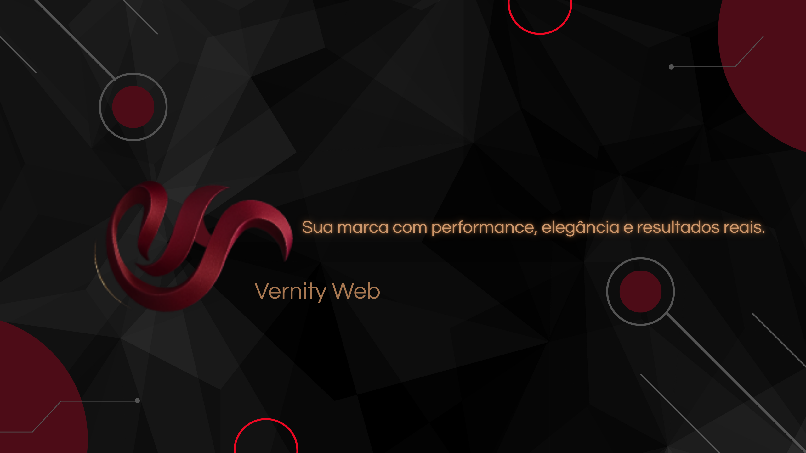

<p align="center">
  
</p>

<h1 align="center">Vanessa Rocha · Frontend Developer</h1>

<p align="center">
  <strong>React.js · TypeScript · Node.js · WordPress · Shopify · AI Integration</strong>
</p>

<p align="center">
Desenvolvedora Frontend com foco em interfaces acessíveis, performáticas e escaláveis. Atuo na <strong>Vernity Web</strong> entregando projetos com React.js, WordPress e Shopify — sempre com atenção a boas práticas de UX, acessibilidade e performance. Tenho ainda background em <strong>Engenharia de Prompts e LLMs</strong>, integrando IA como camada de valor em produtos digitais.
</p>

<p align="center">
📍 Torres, RS &nbsp;·&nbsp; 🌐 <a href="https://www.vernityweb.com.br">vernityweb.com.br</a> &nbsp;·&nbsp; 💼 <a href="https://www.linkedin.com/in/devvanessarocha/">LinkedIn</a> &nbsp;·&nbsp; 📱 <a href="https://wa.me/5551810321080">WhatsApp</a>
</p>

---

## 🛠 Stack

### Principais Tecnologias


### Inteligência Artificial & Engenharia de Prompt


### Banco de Dados


### Ferramentas & Plataformas


---

## 📊 GitHub Stats

<div align="center">
  
  
</div>

---

## 📫 Contatos

| Plataforma | Link |
|---|---|
| 🌐 Site | [vernityweb.com.br](https://www.vernityweb.com.br) |
| 📸 Instagram | [@vernityweb](https://www.instagram.com/vernityweb) |
| 💼 LinkedIn | [linkedin.com/in/devvanessarocha](https://www.linkedin.com/in/devvanessarocha/) |
| 📱 WhatsApp | [+55 51 8103-2108](https://wa.me/5551810321080) |

---

## 🌍 Idiomas

- Inglês: Técnico Intermediário (focado em comunicação profissional e internacionalização)

---

## 🎯 Objetivos Profissionais

- Atuar com desenvolvimento frontend moderno, aplicando React.js, Node.js, WordPress e Shopify em projetos escaláveis e acessíveis.
- Integrar Inteligência Artificial e Engenharia de Prompts para inovação em experiências digitais.
- Evoluir continuamente, buscando oportunidades internacionais e colaborando em equipes multidisciplinares.

---

<p align="center">
  Obrigada por visitar meu perfil! Vamos conectar e criar soluções incríveis. 🚀
</p>
````

Pronto pra colar! A principal mudança além do telefone foi o "sobre mim" mais direto e o GitHub Stats adicionado.
